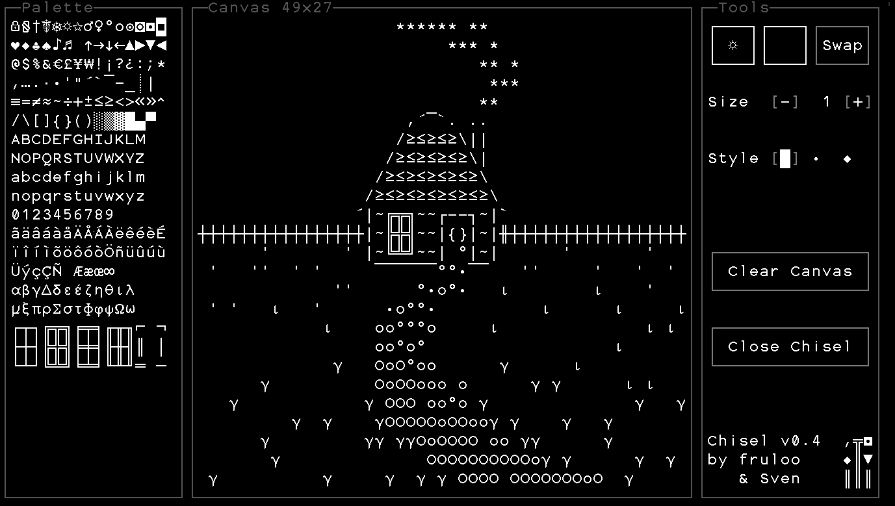

# Chisel

ASCII graphics tool for drawing and making sprites in Stone Story RPG.

## Instructions
For Mobile or PC:
- Copy and paste into your mindstone.

For PC Only:
- Download the script to your stonescript folder and import with `import YOUR_PATH_HERE/Chisel.txt`.

## Usage
1. Enter Deadwood Waterfall.
1. Select the desired glyph from the right panel.
1. Use mouse or touchscreen to draw on the center panel.

## Screenshots

## Changelog
### v0.4 (2024-01-28) (Sven)
- Rearranged Glyph Table
- Made Layout maximize to adapt to screen size
- Added Exit Button and removed Default Pause button
- Disabled banner and stopped ambient sound
- Added check to replace grappling hook with throwing stone
- Changed logo to reflect a chiseling set
### v0.3 (2023-11-05) (fruloo)
- Added brush size option.
- Added three brush style options, rectangle, circle, and diamond.
- Extended palette selection region so it's possible to select the blank region at the bottom.
### v0.2 (2023-11-05) (fruloo)
- Added right mouse button drawing. (PC only)
- Improved UI design.
- Fixed layout issues for certain screen sizes.
### v0.1 (2023-11-05) (fruloo)
- Initial release.

## Credits
- fruloo
- Sven